# 🎯 QuizMaster

QuizMaster is an interactive quiz platform designed to help users test their knowledge, practice different technical topics, and track their learning performance.

The application provides both full quizzes and topic-wise quizzes, along with performance analysis and personalized recommendations based on weak areas.

---

## ✨ Features

- 🔐 User Registration and Login
- 📝 Full Quiz with multiple-choice questions
- 🎯 Topic-wise Quiz
- 📚 Multiple technical topics including:
  - JavaScript
  - React
  - Node.js
  - MongoDB
  - Express.js
  - MERN Stack
  - REST API
  - Authentication
- 📊 Quiz Result and Score Calculation
- 📈 Performance Tracking
- ⚠️ Weak Topic Detection
- 💡 Personalized Recommendations
- 📱 Responsive and user-friendly interface

---

## 🛠️ Tech Stack

### Frontend

- React.js
- JavaScript
- CSS

### Backend

- Node.js
- Express.js

### Database

- MongoDB

### Other Technologies

- REST API
- Authentication
- Vite

---

## 📸 Screenshots

### 🏠 Home Page

<p align="center">
  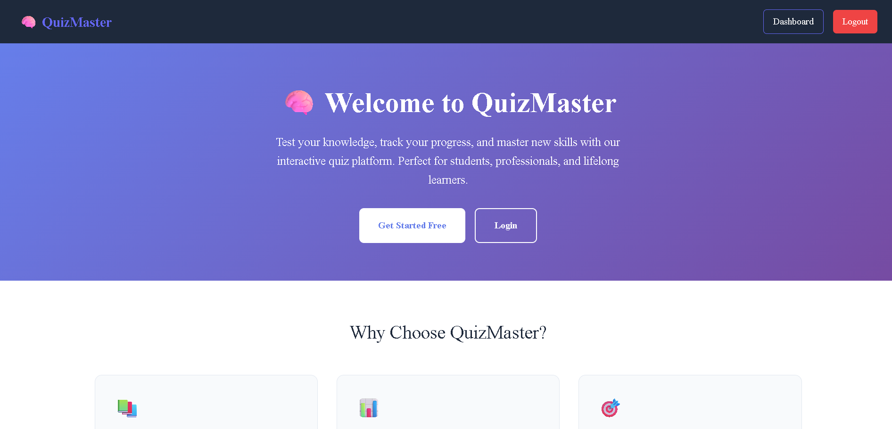
</p>

---

### 🔐 Login Page

<p align="center">
  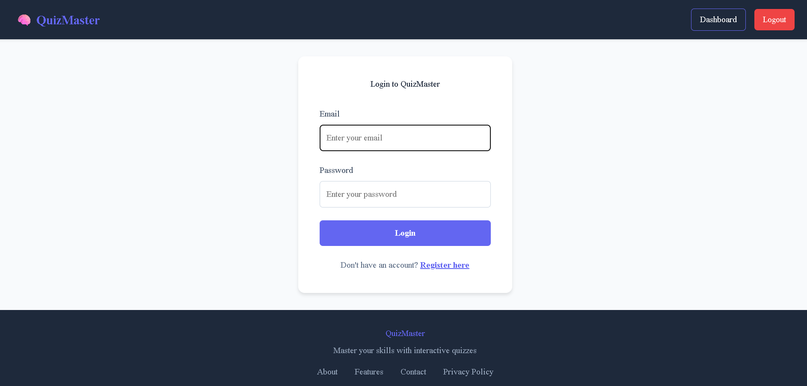
</p>

---

### 📝 Registration Page

<p align="center">
  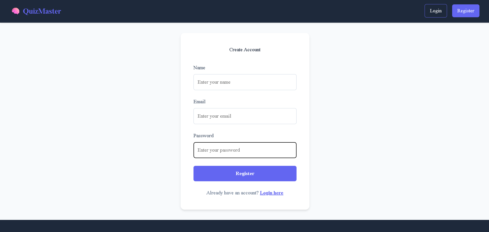
</p>

---

### 📊 Dashboard

<p align="center">
  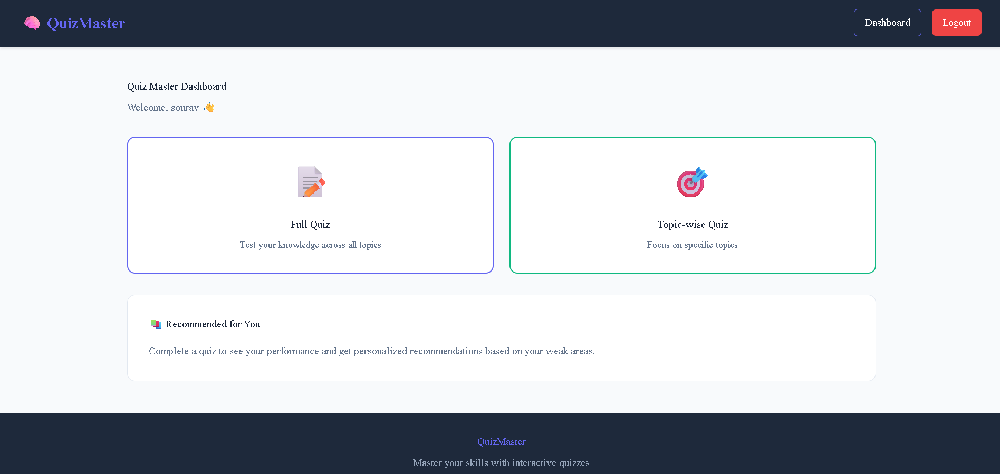
</p>

---

### 📝 Full Quiz

Users can attempt a complete quiz containing questions from different technical topics.

<p align="center">
  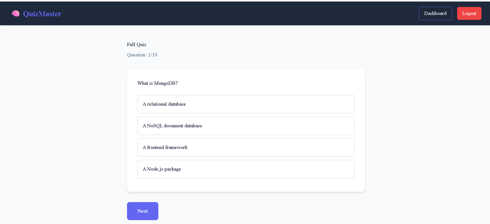
</p>

---

### 📋 Full Quiz Result

After completing the quiz, users can view their score and choose to retake the quiz or view their performance.

<p align="center">
  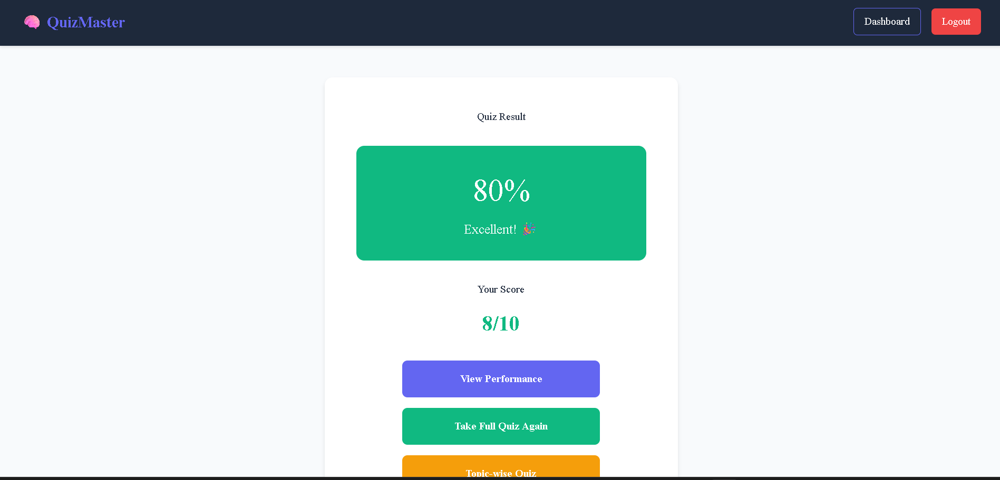
</p>

---

### 📈 Full Quiz Performance

The performance section analyzes the user's quiz results and identifies strong and weak topics.

<p align="center">
  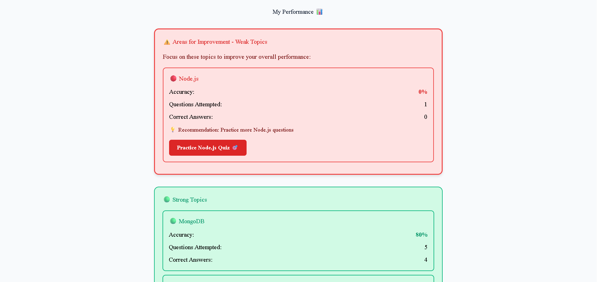
</p>

---

### 🎯 Topic-wise Quiz

Users can select a specific topic and practice questions related to that topic.

<p align="center">
  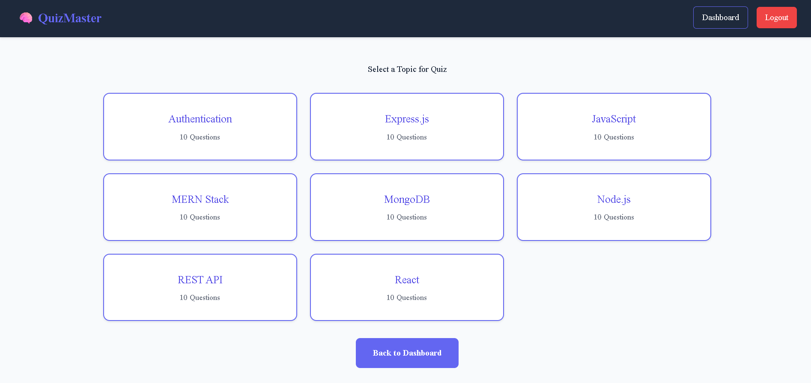
</p>

---


### 🎯 Topic Quiz

Users can attempt questions specifically related to a selected topic.

<p align="center">
  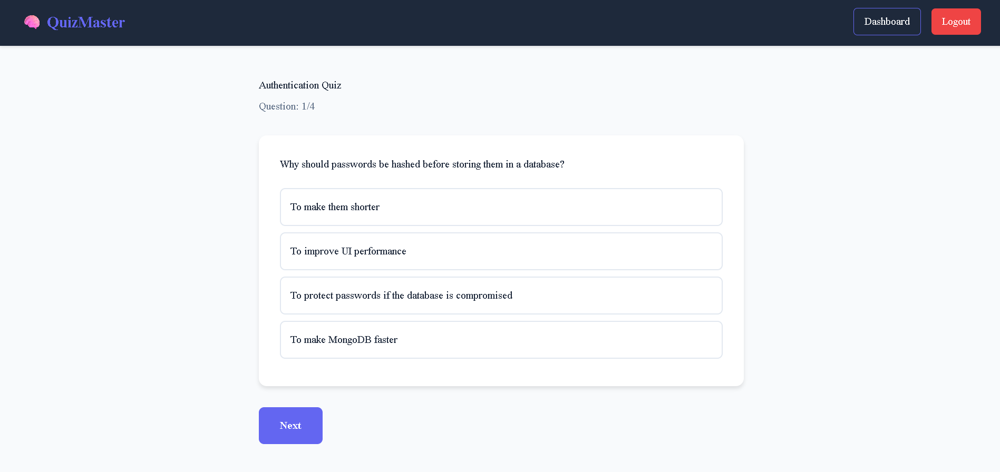
</p>

---

### 📝 Topic Quiz Submission

<p align="center">
  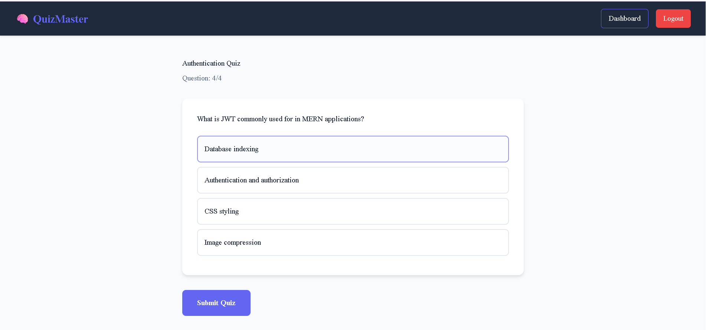
</p>

---

### 📊 Topic Quiz Result

<p align="center">
  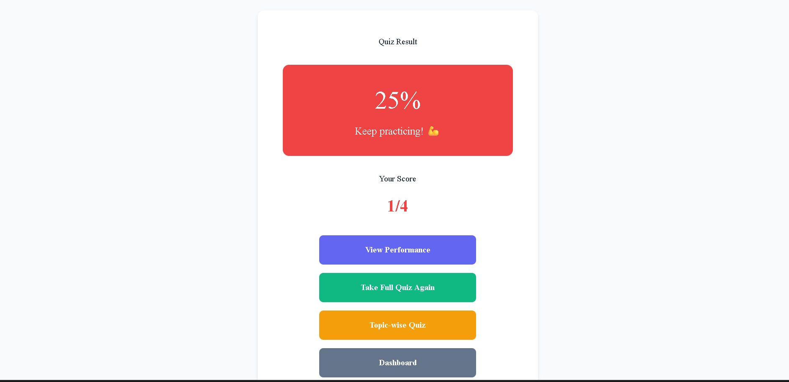
</p>

---

### ⚠️ Topic Performance

Users can view detailed performance information for individual topics and identify areas that need improvement.

<p align="center">
  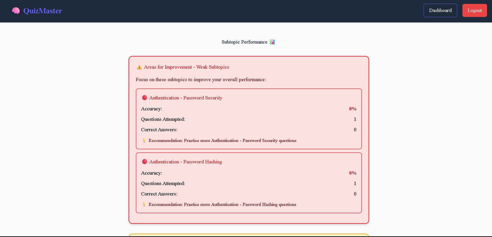
</p>

---

## 📂 Project Structure

```text
QuizMaster/
│
├── client/
│   ├── src/
│   ├── public/
│   └── package.json
│
├── server/
│   ├── controllers/
│   ├── models/
│   ├── routes/
│   ├── middleware/
│   ├── server.js
│   └── package.json
│
├── screenshots/
│   ├── Home_Page.png
│   ├── Login_Page.png
│   ├── Registration.png
│   ├── Dashboard.png
│   ├── TopicWise.png
│   ├── FullQuiz_start.png
│   ├── FullQuiz_Result.png
│   ├── FullQuiz_performance.png
│   ├── Topic_performace.png
│   ├── TopicQuiz_start.png
│   ├── TopicQuiz_End.png
│   └── TopicQuiz_Result.png
│
└── README.md
```
---

## 🎯 How It Works

- Create an account using the registration page.
- Log in to QuizMaster.
- Access the dashboard.
- Choose between a Full Quiz or Topic-wise Quiz.
- Answer the multiple-choice questions.
- Submit the quiz and view your score.
- Open the performance section to analyze your results.
- Review weak topics and practice recommended areas.

---

## 📊 Performance Analysis
QuizMaster analyzes quiz performance and provides information such as:
- Accuracy
- Questions attempted
- Correct answers
- Strong topics
- Weak topics
- Recommended topics for further practice
This helps users identify areas where they need additional practice.

---

## 🔮 Future Improvements
-  🏆 Leaderboard
-  ⏱️ Quiz timer
-  📅 Quiz history
-  📊 Advanced performance charts
-  👨‍💼 Admin dashboard
-  ➕ Admin question management
-  🌙 Dark mode
-  📱 Improved mobile experience

---

## 👨‍💻 Author
-  Sourav Kumar Jha
-  GitHub: [@SouravKJ](https://github.com/SouravKJ)

---

## 📄 License
This project is open-source and available under the MIT License.

### One important correction

The `Project Structure` section I gave above assumes you have `client/` and `server/` folders. **Don't use that section if your actual project has a different structure.**

Also, based on your screenshots, I would **not call QuizMaster only a "frontend project"** in the README if your React app actually communicates with your Node/Express/MongoDB backend.

### Put your screenshots here

Inside your project:

```text
D:\backendPrac\QuizMaster
```
